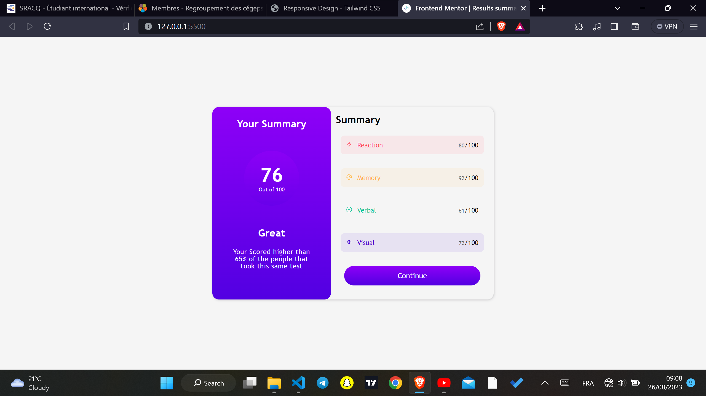

# Frontend Mentor - Results summary component solution

This is a solution to the [Results summary component challenge on Frontend Mentor](https://www.frontendmentor.io/challenges/results-summary-component-CE_K6s0maV). Frontend Mentor challenges help you improve your coding skills by building realistic projects. 

## Table of contents

- [Overview](#overview)
  - [The challenge](#the-challenge)
  - [Screenshot](#screenshot)
  - [Links](#links)
- [My process](#my-process)
  - [Built with](#built-with)
  - [What I learned](#what-i-learned)
  - [Continued development](#continued-development)
  - [Useful resources](#useful-resources)
- [Author](#author)
- [Acknowledgments](#acknowledgments)

## Overview
   - This project requieres users to have well unsderstood the basics of HTML and CSS
   - Building this is more complicated than what you can imagine a first sight
   - From playing wih css Grid and Flex box all the way to undestanding how to align element in the various containers
### The challenge

Users should be able to:

- View the optimal layout for the interface depending on their device's screen size
- See hover and focus states for all interactive elements on the page

### Screenshot

### Links

- Solution URL: [Add solution URL here](https://your-solution-url.com)
- Live Site URL: [Add live site URL here](https://your-live-site-url.com)

## My process
  - This was little bit technical for me . I first used css grid to template properties to create the 2 section of the design . All bound to one main grid container.
  - In the left container i displayed all items to flex direction column and and justified the items to space around so they dont touch the baseline of the container.
  - In the right container i did same but created an inners container to carry the results and the button only.
  - The header (Summary) is out of this container 
### Built with

- Semantic HTML5 markup
- CSS custom properties
- Flexbox
- CSS Grid
- Mobile-first workflow

### What I learned
 
 - How to use Css grid and its grid template component

If you want more help with writing markdown, we'd recommend checking out [The Markdown Guide](https://www.markdownguide.org/) to learn more.

### Continued development

 - Still not comfortable in using css grid to create reponsive Design 
 - I will like to focus more on this area to easily create responsive design with grid
 - Responsive design on its own is still a great barrier for me i can create beautiful designs but when it comes to making it reesponsive i'm out

## Author

- Website - [Abiel Brigth @lias icode_11](https://www.your-site.com)
- Frontend Mentor - [@yourusername](https://www.frontendmentor.io/profile/yourusername)
- Twitter - 

